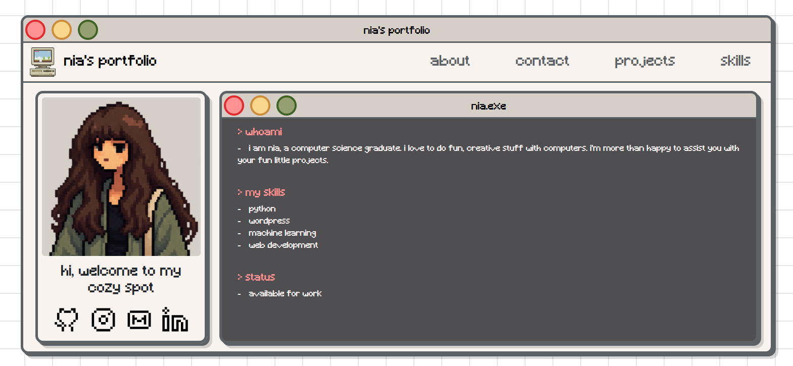

# Starcolder Portfolio Theme

A custom WordPress theme built for my personal portfolio website.

The project combines a retro computer-inspired interface with a modern, responsive layout. The design is heavily inspired by old Macintosh interfaces, pixel art, and terminal-style UI elements.

## Preview



## Features

* Custom WordPress theme built from scratch
* Responsive design for desktop, tablet, and mobile
* Retro / pixel-art inspired UI
* Custom window-style layout
* Responsive navigation menu
* Custom project post type
* Individual project pages
* Skills section
* Contact page with Contact Form 7 integration
* Custom 404 page
* Custom typography and local font integration
* Bootstrap-based responsive layout
* Custom CSS components and styling
* SVG-based UI elements and icons

## Technologies

* **WordPress**
* **PHP**
* **HTML5**
* **CSS3**
* **Bootstrap 5**
* **JavaScript**
* **Contact Form 7**

## Theme Structure

```text
portfolio/
├── css/
│   └── style.css
├── fonts/
│   └── Minecraft.ttf
├── images/
│   ├── favicon.png
│   ├── Pixel_art_old_computer.png
│   └── profile.png
├── templates/
│   ├── contact.php
│   ├── index-contact.php
│   ├── index-hero.php
│   ├── index-navbar.php
│   ├── index-projects.php
│   └── index-skills.php
├── 404.php
├── footer.php
├── functions.php
├── header.php
├── index.php
├── page.php
├── projects.php
├── single-project.php
├── single.php
├── skills.php
└── style.css
```

## Installation

This repository contains the custom theme, not the complete WordPress installation.

### 1. Clone the repository

```bash
git clone https://github.com/starcolder/portfolio-website.git
```

### 2. Copy the theme

Move the `portfolio` folder into:

```text
wp-content/themes/
```

### 3. Activate the theme

From the WordPress dashboard:

**Appearance → Themes → Activate**

### 4. Install required plugins

For the complete functionality of the website, install the plugins required by the theme, including:

* Contact Form 7

## Custom Post Type

The theme includes a custom post type for portfolio projects.

Each project can have its own:

* Title
* Featured image
* Content
* Project details
* Individual project page

## Design

The visual design is based on a retro computing aesthetic, using:

* Pixel-inspired typography
* Macintosh-style windows
* Retro borders
* Pixel-art imagery
* Terminal-inspired elements
* Minimal color palette
* Responsive Bootstrap utilities

The goal was to create a portfolio that feels like an old computer interface while remaining usable on modern devices.

## Development

This theme was developed locally using:

* XAMPP
* WordPress
* Visual Studio Code
* Git
* GitHub

## Future Improvements

Some planned improvements include:

* Further accessibility improvements
* Performance optimization
* More animations and interactive elements
* Additional project metadata
* Improved mobile interactions

## Author

**Nia / Starcolder**

GitHub: [@star]()
